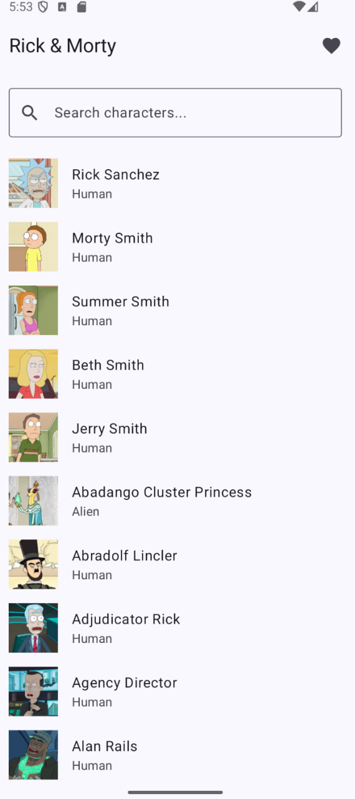
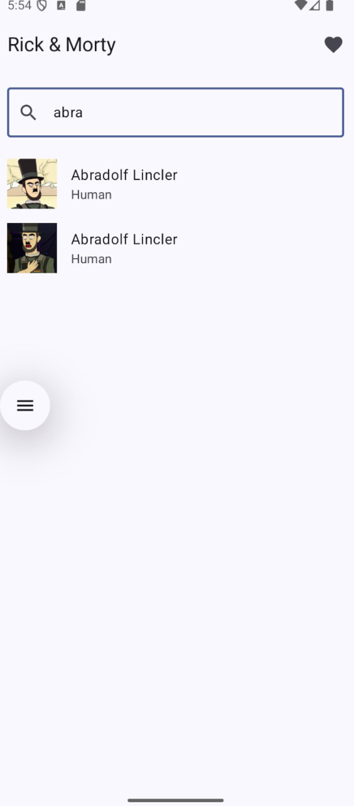
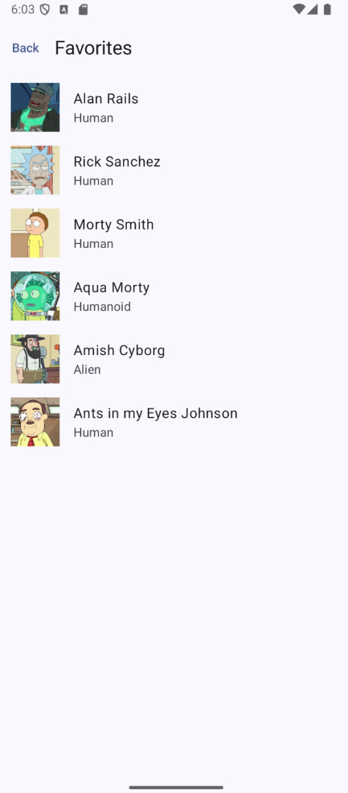

# Домашнее задание 4: Hilt + Room поверх проекта из ДЗ №3

### ФИО: Полатинский Артем
### Группа: ПИКД(2)

---

## Выбранный API: Rick and Morty API
Описание: Для проекта был выбран Rick and Morty API. Это RESTful API, которое предоставляет информацию о персонажах мультсериала. В приложении реализовано получение списка героев, поиск по имени и детальный просмотр информации.

## Что нового в ДЗ №4
1. **Dagger Hilt**: Полная миграция на Dependency Injection. Все зависимости (Retrofit, OkHttpClient, AppDatabase, Dao, Repository) предоставляются через Hilt-модули (`NetworkModule`, `DatabaseModule`), а не создаются вручную.
2. **Room Database**: Реализовано хранение избранных персонажей в БД Room (таблица `favourites`). Данные сохраняются локально и переживают перезапуск приложения.
3. **Реактивная архитектура**: ViewModels переписаны на реактивные цепочки с использованием Flow-операторов (`combine`, `debounce`, `flatMapLatest`, `stateIn`). Все изменения избранного обновляются реактивно через Room Flow.
4. **Разделение ViewModel**: Каждому экрану выделена собственная специализированная ViewModel (`ListViewModel`, `DetailViewModel`, `FavoritesViewModel`), что решает проблему переиспользования старого стейта при навигации.
5. **Оптимизации**: В списках `LazyColumn` добавлены уникальные ключи (`key = { it.id }`), а кнопке добавления в избранное задано описание `contentDescription` для поддержки TalkBack.

## Хранение в Room
* **Таблица**: `favourites`
* **Сущность**: `CharacterEntity`
* **Поля**: `id` (PrimaryKey), `name`, `status`, `species`, `type`, `gender`, `image`, `originName`, `locationName`.

## Сценарий проверки работоспособности Room
1. Запустите приложение.
2. Найдите любого персонажа (например, "Rick Sanchez") и перейдите на его детальный экран.
3. Нажмите кнопку **"Add to Favorites"** (кнопка поменяется на "Remove from Favorites", иконка сердца заполнится).
4. Закройте приложение (смахните его из панели запущенных процессов).
5. Запустите приложение снова и перейдите на экран **"Favorites"** (иконка сердца в верхнем меню).
6. Убедитесь, что добавленный персонаж отображается в списке избранного.

## Скриншоты
В данной секции представлены скриншоты работы приложения (размещены в папке screenshots):

| Состояние | Скриншот |
| :--- | :--- |
| Список персонажей (List) |  |
| Поиск (Search) |  |
| Детали персонажа (Detail) |  |
| Избранное (Favorites) |  |

---
